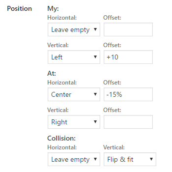

CMB2 Field Type: Position
==================

Custom field for [CMB2](https://github.com/WebDevStudios/CMB2) to store a [jquery UI position](https://jqueryui.com/position/) values.



## Examples

```php
add_action( 'cmb2_admin_init', 'cmb2_ajax_search_metabox' );
function cmb2_position_metabox() {

	$prefix = 'your_prefix_demo_';

	$cmb_demo = new_cmb2_box( array(
		'id'            => $prefix . 'metabox',
		'title'         => __( 'Position Metabox', 'cmb2' ),
		'object_types'  => array( 'page', 'post' ), // Post type
	) );

	// Basic example
	$cmb_demo->add_field( array(
		'name'          => __( 'Default field', 'cmb2' ),
		'desc'          => __( 'Field description (optional)', 'cmb2' ),
		'id'            => $prefix . 'default_position',
		'type'          => 'position',
	) );

	// Extended example
	$cmb_demo->add_field( array(
		'name'              => __( 'Extended field', 'cmb2' ),
		'desc'              => __( 'Field description (optional)', 'cmb2' ),
		'id'                => $prefix . 'extended_position',
		'type'              => 'position',
		//'hide_my'           => true, // Hide my fields
		'my_text'           => __( 'Me:', 'cmb2' ), // Default 'My:'
		//'hide_at'           => true, // Hide at fields
		'at_text'           => __( 'To:', 'cmb2' ), // Default 'At:'
		//'hide_collision'    => true, // Hide collision fields
		'collision_text'    => __( 'On touch:', 'cmb2' ), // Default 'Collision:'
	) );

}
```

## Retrieve the field value

```php
    $position = get_post_meta( get_the_ID(), 'your_field_id', false );

    echo 'My: ' . $position['my_horizontal'] . $position['my_horizontal_offset'] . ' ' . $position['my_vertical'] . $position['my_vertical_offset'];
    echo 'At: ' . $position['at_horizontal'] . $position['at_horizontal_offset'] . ' ' . $position['at_vertical'] . $position['at_vertical_offset'];
    echo 'Collision: ' . $position['collision_horizontal'] . ' ' . $position['collision_vertical'];
```

## Changelog

### 1.0.0
* Initial commit
